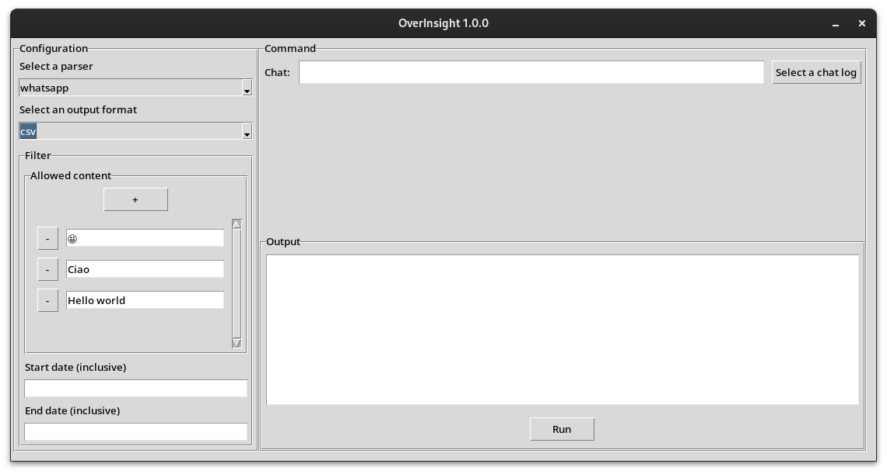

# OverInsight

OverInsight: A Python tool for analyzing chat logs from popular messaging apps, tracking specified messages. 

## Description


OverInsight is a Python tool designed to analyze chat logs from various messaging apps, including WhatsApp, Telegram, and others*. It meticulously identifies specified valid messages, whether they're emojis, words, or sentences, and tallies their occurrences. Each message must precisely match a valid message to be counted. Users have the option to save parsed messages in CSV format, allowing for further analysis with other tools. Additionally, OverInsight provides insights into message frequency per user.

*Please note that, at present, OverInsight exclusively supports parsing WhatsApp logs.



## Getting Started

### Dependencies

* python 3.6
* tkinter
* tkCalendar

### Installing

1. Go to *Releases*
2. Download the executable for you operating system

or run from source code:
```sh
git clone https://github.com/Antonio-Rocchia/OverInsight.git
```

### Executing program

### Usage

Running the program without any flags will open the GUI. 

```sh
usage: main.py [-h] [--config CONFIG_FILE] [--parser MESSAGING_APP] [CHAT_LOG]

OverInsight: A Python tool for analyzing chat logs from popular messaging apps.

positional arguments:
  CHAT_LOG              The path to the chat log

options:
  -h, --help            show this help message and exit
  --config CONFIG_FILE  The path to the config file
  --parser MESSAGING_APP
                        The name of the messaging app that generated the logs. Will override 'parser' if specified in the config file

For more information, visit: https://github.com/Antonio-Rocchia/OverInsight
```

#### Content filter
```toml
parser = "whatsapp" # Supported options (whatsapp)
# Support multiple output in the same run
output = ["csv", "stdout"] # Supported options (csv, stdout)

[filter]
# An empty content filter will not filter any message
allowed_content = [
    "😂",
    "Hello",
    "My name is Antonio"
]
# Date filter (inclusive)
# You can specify either a start or a end date, or both
start_date = 2024-05-27 # YYYY-MM-DD
end_date = 2024-05-28 # YYYY-MM-DD
# Time filter (inclusive)
# Not supported by the GUI, CLI mode only
# You can specify either a start or a end date, or both
start_time = 06:00:00 
end_time = 23:00:00
```

### Exporting: Whatsapp guide

#### Android:

* Open a chat/group chat
* Tap on three dots on the top right
* Tap "More"
* Choose "Export chat"
* Choose "Without Media"

#### iOS

* Open a chat/group chat
* Tap on contact name/group name on the top to see the details
* Scroll down to find "Export Chat" menu
* Choose "Without Media"

## Authors

[Antonio Rocchia](https://github.com/Antonio-Rocchia)

## Version History

* 1.0.0
    * GUI
    * Better configuration format 
* 0.1
    * Initial Release

## License

This project is licensed under the MIT License - see the LICENSE.md file for details

## Acknowledgments

* [PetengDedet/WhatsApp-Analyzer](https://github.com/PetengDedet/WhatsApp-Analyzer)
* [j4321/tkcalendar](https://github.com/j4321/tkcalendar)
